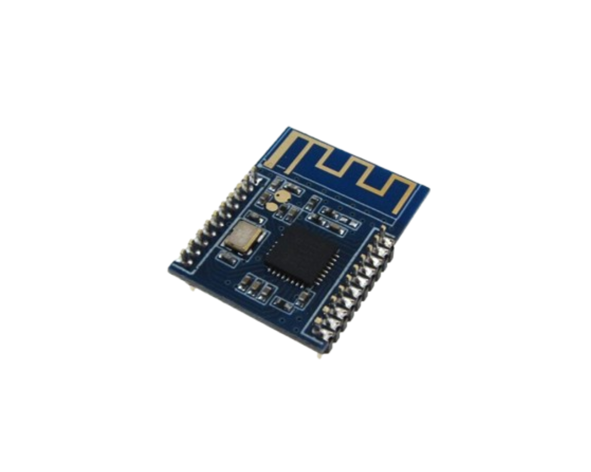

<h1 align="center">
  <br>
  <a href=""></a>
  <br>
  📡 2.4 GHz Antenna CST-MATLAB
  <br>
</h1>

<h4 align="center">
  ISM standard 2.4GHz antenna using <a href="https://github.com/simos421/CST-MATLAB-API" target="_blank">CST-MATLAB-API</a>
</h4>

<p align="center">
  <a href="#overview">Overview</a> •
  <a href="#key-features">Key Features</a> •
  <a href="#how-to-use">How To Use</a> •
  <a href="#download">Download</a> •
  <a href="#related">Related</a> •
  <a href="#license">License</a>
</p>

---

## Overview

This project focuses on the design and simulation of a 2.4 GHz antenna using **CST Studio Suite** and **MATLAB**. It is aimed at the **ISM band (2.4–2.5 GHz)**, which is extensively used in Wi-Fi, Bluetooth, and IoT applications. The design process is facilitated through MATLAB scripting and leverages the [CST-MATLAB-API](https://github.com/simos421/CST-MATLAB-API) for antenna generation and analysis.

---



## Key Features

- **Antenna Geometry**: 
  - Chip Antenna
  - Parameterized Geometry
  - 2.4 GHz Antenna
- **MATLAB Scripting**:
  - MATLAB Scripting for Antenna Design
  - CST-MATLAB-API Integration
- **Simulation and Analysis**:
  - CST Studio Suite Simulation
  - Antenna Performance Analysis

---

## How To Use

Follow these steps to clone the repository, set up the project, and run the MATLAB script to generate the antenna design and perform simulations.

---

### ✅ 1. Clone the Repository

Open your terminal and run:

```matlab
git clone https://github.com/simos421/CST-MATLAB-API.git
cd CST-MATLAB-API
```

### ✅ 2. Open the project
 - Open `antenna.m` script using MATLAB.
 - Run the script.

 Note: The script will generate the antenna design and perform simulations.

---

### Download

Make sure you have the following installed:

-  [CST Studio Suite 2019 or later](https://software.3ds.com/)
-  [CST Studio Tutorial](https://r1132100503382-eu1-3dswym.3dexperience.3ds.com/community/swym:prd:R1132100503382:community:39?content=swym:prd:R1132100503382:wikitree:_NXifU43Q7yHzTiCX9yEaw)
-  [MATLAB R2019b or later](https://www.mathworks.com/downloads/?s_tid=rh_bn_dl/)

Note: Select the correct version of CST Studio Suite [2024].

---

## Related
- 📡 **YouTube Channel for More Tutorials**:  
  [@tensorbundle](https://www.youtube.com/@tensorbundle) – Antenna simulation, CST-MATLAB API walkthroughs, and other engineering content.

- 📄 **MATLAB Antenna Toolbox**:  
  [Antenna Toolbox - MathWorks](https://www.mathworks.com/products/antenna.html)

## License

This project is licensed under the **MIT License**.

You're free to use, modify, distribute, and share this code — even commercially — as long as you include the original copyright.

```text
MIT License

Copyright (c) 2025 xdarksoulEngineer

Permission is hereby granted, free of charge, to any person obtaining a copy
of this software and associated documentation files (the “Software”), to deal
in the Software without restriction...

```
---

> [Linkedin](https://www.linkedin.com/in/milchis-catalin-marian-824b61335/) &nbsp;&middot;&nbsp;
> GitHub [@xdarksoulEngineer](github.com/DarkSoulEngineer) &nbsp;
