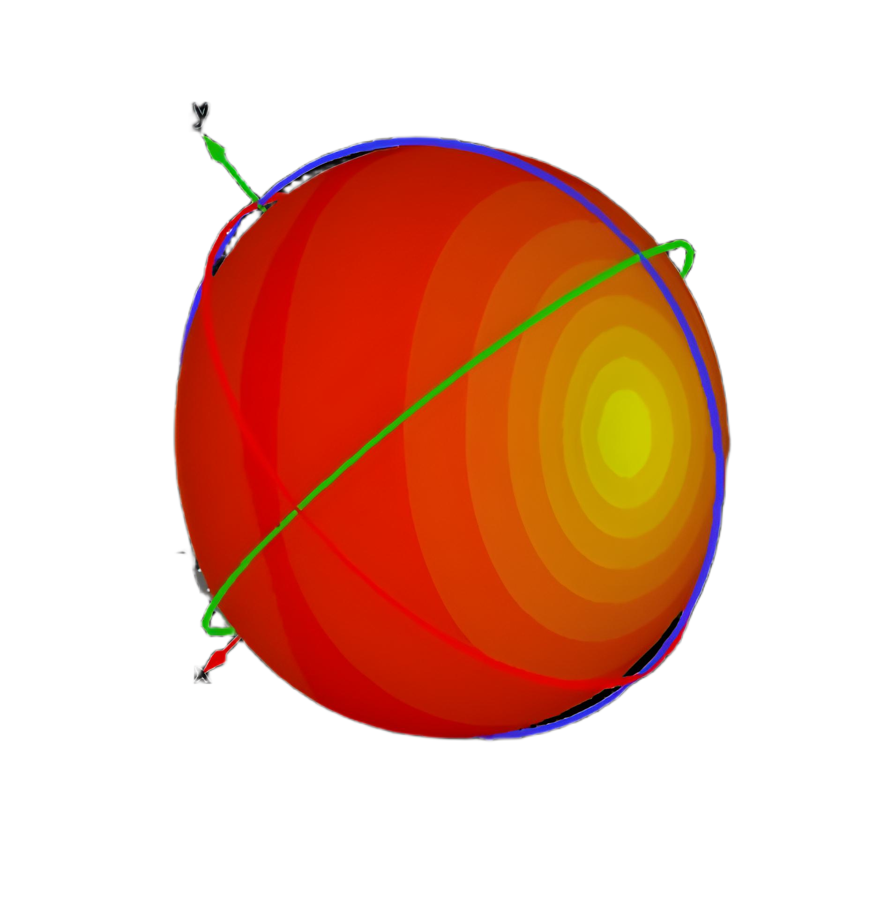
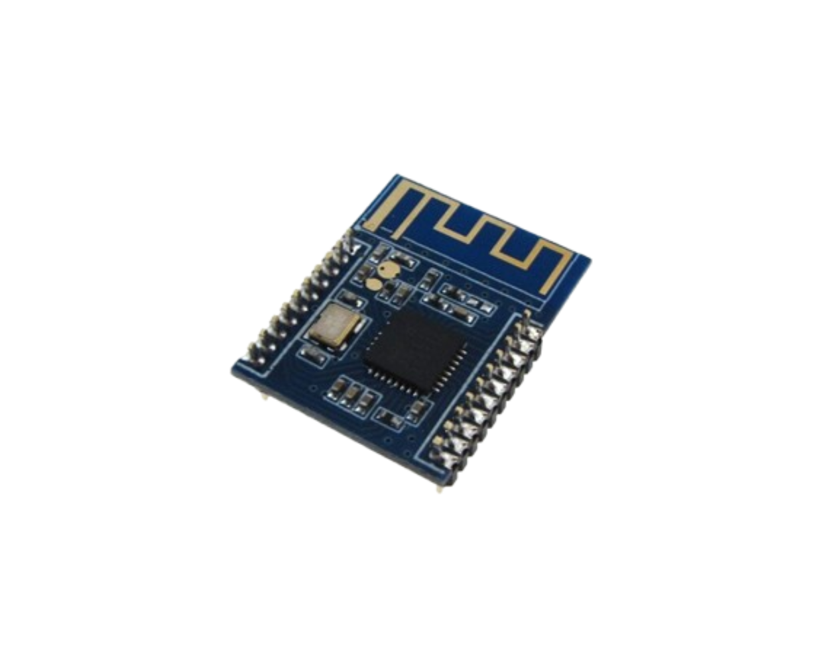

# CST-MATLAB-2.4Ghz-Antenna
**ISM standard 2.4–2.5 GHz microstrip antenna for microcontroller-based wireless and IoT systems**

[](LICENSE)


<p align="center">
  
</p>

## Table of Contents

- [Overview](#overview)
- [Key Features](#key-features)
- [Requirements](#requirements)
- [Installation](#installation)
- [Usage](#usage)
- [Screenshots](#screenshots)
- [Related Links](#related-links)
- [License](#license)

## Overview

This project designs and simulates a 2.4 GHz microstrip antenna in **CST Studio Suite**, scripted from **MATLAB**. It covers the ISM band (2.4–2.5 GHz) used by Wi-Fi, Bluetooth, and IoT. The script drives [CST-MATLAB-API](https://github.com/simos421/CST-MATLAB-API) to build the parameterized model, run the solver, and export the results, with no manual modeling in the CST GUI.

## Key Features

- Parameterized chip antenna geometry generated from `antenna.m`
- Design and post-processing automated through the CST-MATLAB-API
- Frequency-domain simulation from 2.4 to 2.4835 GHz (201 points)
- Far-field monitor at 2.4 GHz and S-parameter export

## Requirements

- [CST Studio Suite 2019 or later](https://software.3ds.com/) (match the API version, e.g. 2024)
- [MATLAB R2019b or later](https://www.mathworks.com/downloads/?s_tid=rh_bn_dl/)
- [CST-MATLAB-API](https://github.com/simos421/CST-MATLAB-API) cloned into `./CST-MATLAB-API`
- Windows: the script drives CST Studio through MATLAB COM automation (`actxserver`)

## Installation

```bash
git clone https://github.com/DarkSoulEngineer/CST-MATLAB-2.4Ghz-Antenna.git
cd CST-MATLAB-2.4Ghz-Antenna
git clone https://github.com/simos421/CST-MATLAB-API.git
```

The API must sit in `./CST-MATLAB-API` next to `antenna.m`, where the script's `addpath` calls expect it.

## Usage

1. Open `antenna.m` in MATLAB with CST Studio Suite installed and licensed.
2. Run the script. It launches CST Studio via COM automation and builds the antenna geometry: copper trace segments, Teflon PCB substrate, FR-4 ground plane, and a waveguide feed port. The project is saved as `Antenna_2.4GHz.cst`.
3. The script sets the frequency-domain solver to 2.4–2.4835 GHz (201 points), adds a far-field monitor at 2.4 GHz, and exports the S-parameters to `./OUTPUT/s_param.txt`.
4. Review the S-parameter and far-field results in CST Studio Suite.

## Screenshots



## Related Links

- **[YouTube @tensorbundle](https://www.youtube.com/@tensorbundle)**: antenna simulation and CST-MATLAB API walkthroughs.
- **[MATLAB Antenna Toolbox](https://www.mathworks.com/products/antenna.html)**: MathWorks toolbox for antenna analysis.

## License

MIT. See [LICENSE](LICENSE).

> [LinkedIn](https://www.linkedin.com/in/milchis-catalin-marian-824b61335/) &nbsp;&middot;&nbsp;
> GitHub [@DarkSoulEngineer](https://github.com/DarkSoulEngineer)
